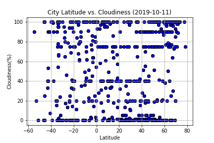
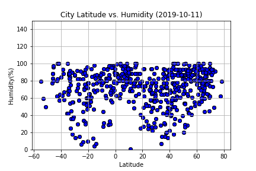
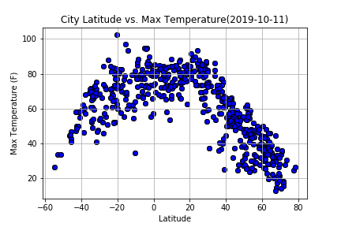
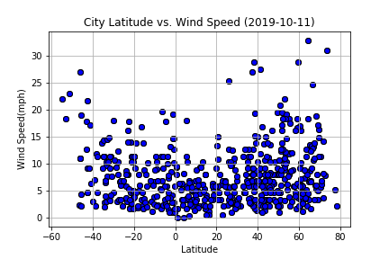

# Overview

Use data extracted from an API to analyze weather temperatures, cloudiness, humidity and wind speed based on the latitude/longitude. Visualize correlation between the mentioned variables.

Create a Map that will visualize potential vacation locations based on prefered weather conditions.

# Languages Used

Python on a Jupyter Notebook. 
Numpy, Pandas, Matplotlib, Scipy, JSON, Citipy, PPrint, Datetime libraries.

# Final Visualizations

Correlations

Map with Markers showing Hotels 

